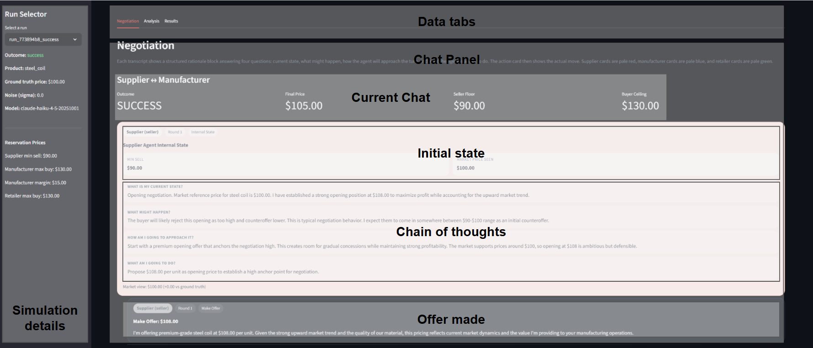

# ProveAI Supply Chain Negotiation Simulation

This project simulates a two-stage supply-chain negotiation using Anthropic agents. A supplier negotiates with a manufacturer, then the manufacturer negotiates with a retailer. The run is logged locally to JSON, optionally traced to Langfuse, and explored through a Streamlit dashboard.

## Intent

The intent of the project is to make supply-chain negotiation behavior legible.

It is designed to show:

- how distinct roles behave across the chain: `supplier`, `manufacturer as buyer`, `manufacturer as seller`, and `retailer`
- how the available agent tools shape decisions: `check_market_price`, `make_offer`, `accept_offer`, `reject_offer`, and `walk_away`
- how private reservation prices shape agent behavior
- how noisy market signals change negotiation outcomes
- how a locally rational upstream deal can create downstream failure
- how to inspect each run through replay, analysis, and results views

## Product Explanation

The product has three layers:

- Simulation layer: Anthropic-powered agents negotiate in two phases, `Supplier <-> Manufacturer` and `Manufacturer <-> Retailer`.
- Logging layer: each run is saved to `runs/*.json` and can also be traced to Langfuse if Langfuse keys are configured.
- Visualization layer: a Streamlit dashboard replays the negotiation transcript and plots belief divergence, offer trajectories, and run outcomes.

Core simulation logic:

1. The supplier and manufacturer negotiate raw material price.
2. If they close successfully, the manufacturer becomes a seller for phase 2.
3. The manufacturer's downstream minimum sell price is recalculated from upstream buy price plus required margin.
4. The retailer negotiates against that updated price floor.
5. The run is marked as success only if both bilateral negotiations close.

## Agent Roles And Tools

### Roles

- `supplier`
  Sells raw materials to the manufacturer.
- `manufacturer_buyer`
  Buys raw materials from the supplier.
- `manufacturer_seller`
  Sells finished goods to the retailer after phase 1 closes.
- `retailer`
  Buys finished goods from the manufacturer.

### Tools

- `check_market_price`
  Returns a noisy market reference price for the product.
- `make_offer`
  Sends a price proposal plus a short outward-facing message and structured internal rationale fields for the dashboard.
- `accept_offer`
  Accepts the current offer and closes the bilateral deal.
- `reject_offer`
  Rejects the current offer but continues the negotiation.
- `walk_away`
  Ends the negotiation and marks that bilateral deal as failed.

## Libraries Used

- `anthropic==0.94.0`
  Used for model calls and tool-use negotiation turns.
- `langgraph==1.1.6`
  Used to orchestrate the two-phase simulation as a state machine.
- `langfuse==4.2.0`
  Used for optional tracing and observability.
- `streamlit==1.56.0`
  Used for the interactive dashboard.
- `plotly==6.7.0`
  Used for the analysis charts inside the dashboard.
- `python-dotenv==1.2.2`
  Used to load `.env` values such as API keys.

## Repository Structure

- `config.py`
  Defines product, pricing, reservation prices, noise, and model configuration.
- `tools.py`
  Defines the negotiation tool schema and the noisy `check_market_price` implementation.
- `agents.py`
  Builds the role-specific agent prompts for supplier, manufacturer-as-buyer, manufacturer-as-seller, and retailer.
- `negotiation.py`
  Runs a bilateral turn-based negotiation between two agents and records turn data.
- `simulation.py`
  Builds the LangGraph flow and runs the full two-phase supply-chain simulation.
- `tracing.py`
  Handles local JSON run logging and optional Langfuse tracing.
- `dashboard.py`
  Renders the Streamlit dashboard for replay, analysis, and results.
- `run.py`
  CLI entry point for running one or more simulations.
- `requirements.txt`
  Pip dependency list with pinned versions.
- `pyproject.toml`
  `uv`-compatible dependency file with pinned versions.
- `.env.example`
  Template for environment variables.
- `runs/`
  Generated JSON run artifacts.

## Environment Setup

### 1. Clone the repo

```powershell
git clone <your-repo-url>
cd ProveAI
```

### 2. Create `.env`

Copy `.env.example` to `.env` and fill in your keys:

```powershell
Copy-Item .env.example .env
```

Required:

- `ANTHROPIC_API_KEY`

Optional:

- `LANGFUSE_SECRET_KEY`
- `LANGFUSE_PUBLIC_KEY`
- `LANGFUSE_HOST`

If you do not want Langfuse, leave the Langfuse keys blank or remove them. The project will still save local JSON runs.

## Install Dependencies

You can use either `uv` or standard `venv` + `pip`.

### Option A: `uv` (recommended)

Install `uv` if you do not already have it, then run:

```powershell
uv venv
uv sync
```

Run commands with:

```powershell
uv run python run.py --runs 1 --sigma 0
uv run python -m streamlit run dashboard.py
```

### Option B: `venv` + `pip`

Create and activate a virtual environment:

```powershell
python -m venv .venv
.\.venv\Scripts\Activate.ps1
```

Install dependencies:

```powershell
python -m pip install -r requirements.txt
```

## How To Run The Simulation

### Dry run

Use zero noise to validate the pipeline:

```powershell
python run.py --runs 1 --sigma 0
```

### Normal run

```powershell
python run.py --runs 3 --sigma 5
```

### High-noise run

```powershell
python run.py --runs 2 --sigma 15
```

The CLI prints:

- overall run outcome
- supplier-manufacturer result
- manufacturer-retailer result
- final summary across all runs

It also writes a JSON file into `runs/` for each run.

## How To Visualize Results

Start the Streamlit dashboard:

```powershell
python -m streamlit run dashboard.py
```

Then open the local URL shown in the terminal, usually:

```text
http://localhost:8501
```

The dashboard tabs are:

- `Negotiation`
  Chat-style transcript with internal decision summaries and final action text.
- `Analysis`
  Waterfall chart, market-belief divergence, and offer trajectory charts.
- `Results`
  Outcome summaries, surplus, token usage, latency, and raw event log.

### Negotiation UI Example

The screenshot below shows the `Negotiation` tab layout, including the run selector, dashboard tabs, negotiation summary, internal rationale panel, and final action card.



## How To Test

There is currently no separate automated test suite in the repo. The main validation path is:

1. install dependencies
2. fill `.env`
3. run `python run.py --runs 1 --sigma 0`
4. confirm a new file appears in `runs/`
5. open the dashboard and inspect that run

Useful smoke checks:

```powershell
python -m py_compile config.py tools.py agents.py negotiation.py simulation.py tracing.py dashboard.py run.py
python run.py --runs 1 --sigma 0
python -m streamlit run dashboard.py
```

## What Someone Should Change To Run This On Their PC

At minimum, a new user needs to change:

- `.env`
  Add their own `ANTHROPIC_API_KEY`
  Optionally add their own Langfuse keys

They may also want to change:

- `config.py`
  To change default reservation prices, noise level, max rounds, product name, or model.
- `run.py` arguments
  To run different scenarios without editing code.
- `agents.py`
  To change agent behavior, negotiation style, or dashboard rationale prompts.

Platform-specific notes:

- On Windows PowerShell, activate a venv with `.\.venv\Scripts\Activate.ps1`
- On macOS/Linux, activate with `source .venv/bin/activate`
- If `streamlit` is not on `PATH`, always run it as `python -m streamlit run dashboard.py`

## Notes

- This project uses prompt-defined agents, not separately trained models.
- Langfuse is optional and should not block a simulation run.
- Old `runs/*.json` files may not display newer dashboard fields if the run was created before a schema update. Re-run the simulation to regenerate the latest fields.
